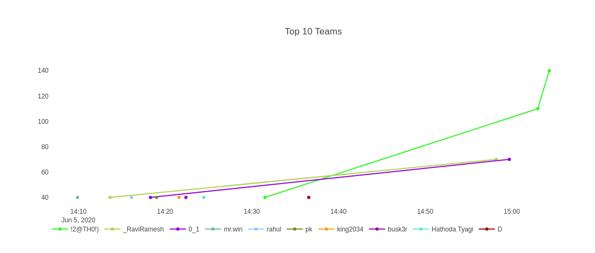

# #CTFFriday 2020JuneWeek1 

* Date: 6th June 2020
* Time: 2:00 to 3:00 PM

## Organized By

    

 <span style="color:red"> Net Square Solutions Pvt. Ltd.</span>                              

## About Me

Hi,

I am [Smit Patel](https://twitter.com/smit_2307) and I am currently working as a Security Analyst at  [Net Square Solutions Pvt. Ltd.](https://net-square.com) I participated in ctf as ```sk```

## Overview

This ```CTF``` is build by [Virendra Singh](https://twitter.com/VEERSAA1) . There were 3 challenges based on Cryptography, Stegnography, Android, Reversing and Cloud.

<h3>Challenge-1</h3>

**Hints :**

1. Observe the file extension and try to extract the files.

**Flag 1 :** 40 Points 

**Description :**

1. For the first flag we have to download one `corona.ab` file. It is an Android back file. From the hint i got to know that i have to extract that file. To extract that file i downloaded an `android-backup-extractor` from git-hub.

2. Now use following command :

 `java -jar abe.jar unpack /root/corona.ab a.tar`

3. This command covert corona.ab file into a.tar file.

  

4. After that i extract a.tar file and its contain numbers of folder and i open one by one folder.

  

5. In the `org.ESFileExplorer` folder there is five sub-folder then i open `ef` folder. 

  

6.  In the folder there is one image and i obeseved the image.

  

7. When i zoom in the image i got the first flag.

 

 `nsctf{StaY_HoME_stAY_SAFe}`

<h3>Challenge-2</h3>

**Flag 1 & 2 :** 100 points

**Hints :**

1. Convert the binary according to the provided message.

2. Make the QR using provided binary and use width 50.

3. List the buckets using provided credentials in QR.

4. Find the permissions for the user.

5. Find the group which have full admin access.

6. Escalate privileges by adding your self to "NSROOT" group

**Description :**

1. Second challenge is based on stegnography and cloud. In this challenge we have to download one binary file and from the hint i got to know that i have to convert this binary file into QR image.

 

2. I converted binary file into QR image with given width of 50 in hint. To convert binary i refer following link:
 
 [https://www.dcode.fr/binary-image](https://www.dcode.fr/binary-image)

 

3. Then i Download that QR image.

 

4. Then i used QR-code scanner and decode it. After decoding i got one `Access key ID` and one `Secret access key`.

  

5. By using this aws Id and Access key i accessed particular user.
for that you have to install `awscli` if there is already installed in your system you have to use following command : 

 `aws configure` 

 After that i entered Access key ID and Secret access key.

 

6. Then used following command `aws s3 ls` this command list out buckets that are belongs to that particulare user.

 

7. After then i used this coomand 

 `aws s3 cp --recursive s3://stayhome /home/kali/Document/abc/`

 By using this command i downloaded `stayhome` bucket into abc directory.

 

8. Then i goto that directory there is one folder named Italy in that folder there is one text file and that text file contain second flag. 

 

 `nsctf{FiRsT_wE_FeeL_TheN_We_Fall}`

9. There is another folder named India that folder contain `path.txt` file. This file contain another Access key ID and Secret access key. 

 

10. After that i used this command `aws configure` and enter that access key id and secret access key.


11. After then i used this coomand

 `aws s3 cp --recursive s3://finaldestination /home/kali/Document/`

 To download the finaldestination bucket but there is one error occured while listing the object from the bucket there is no permission to access bucket for that user.


12. After that i used this command `aws iam get-user`. This command gave me the username that is `corona`. 

 

13. From the hint i got to know that i have to check the attached polices of that user. For that i used following command :

 `aws iam list-attached-user-policies --user-name Corona`

 This command list out the all the attached polices of that user and i got to know al three polices.
 
 

14. By using command `aws iam list-groups` i list out the groups from the hint i got to know that `NSROOT` group user have admin level privileges.

 

15. By using the policy `AddUserToGroup` i added Corona user to NSROOT group for that i used following command:

 `aws iam add-user-to-group --group-name NSROOT --user-name Corona`

 

16.  After then i used Following command

 `aws s3 cp --recursive s3://finaldestination /home/kali/Document/`

 To Download `finaldestination` bucket into my Document directory.

 

17. Then i go to that directory where bucket downloaded that contains final flag folder in that folder one text file named finalflag.txt that contains third flag.

 

 `nsctf{CoRoNa_Ko_Bhagayenge_Fir_hum_GHA_Se_BaHr_AayenGE}`

<h3>Challenge-3</h3>

**Flag 4 :** 50 points 

**Description :**

1. Third challenge based on ios, reversing and cryptography. In this challenge we have to download one zip file that contains following files and folders. Then i observed one by one files. 

 

2. In the `challenge.plist` there is a one string i observed which is encrpted.

 
 
3. Then i started reversing using `Ghidhra` tool and started analysing file named `covid19`. While analysing that file i observed one class function `secretMaanager:key:iv:data:` that contains aes key. by using this aes key we can decrpt that string that we found in challenge.plist file.

  

4. Openssl is using hex value of key to decrypt the string so we have to convert that aes key into hexadecimal. so i coverted key into hexadecimal by using online converter.

 

5. Here i don't that which encryption algorithm is used for the string so i created one file named `aes` i used 7 algorithm. And copy that string into one file named `string`.

 

6. To decrpt that string i used one small bash script which is

 `for i in cat aes; do cat string | openssl enc -d -$i -K 214125442A472D4B6150645367566B59 -iv 0 -base64; done`

 and i got the fourth flag.

 

 `nsctf{Don't_Let_Yesterday_Take_Up_Too_Much__0f_Today}`

It was a very nice CTF by [Virendra Singh](https://twitter.com/VEERSAA1). We had lots of fun by solving it and learnt new things.

Here are the scoreboard of CTF.


